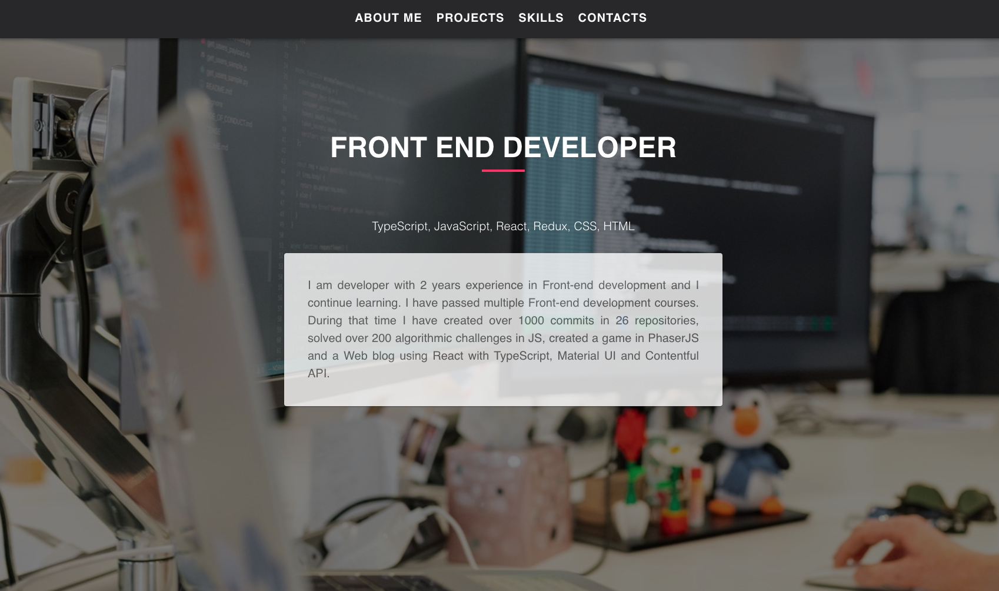
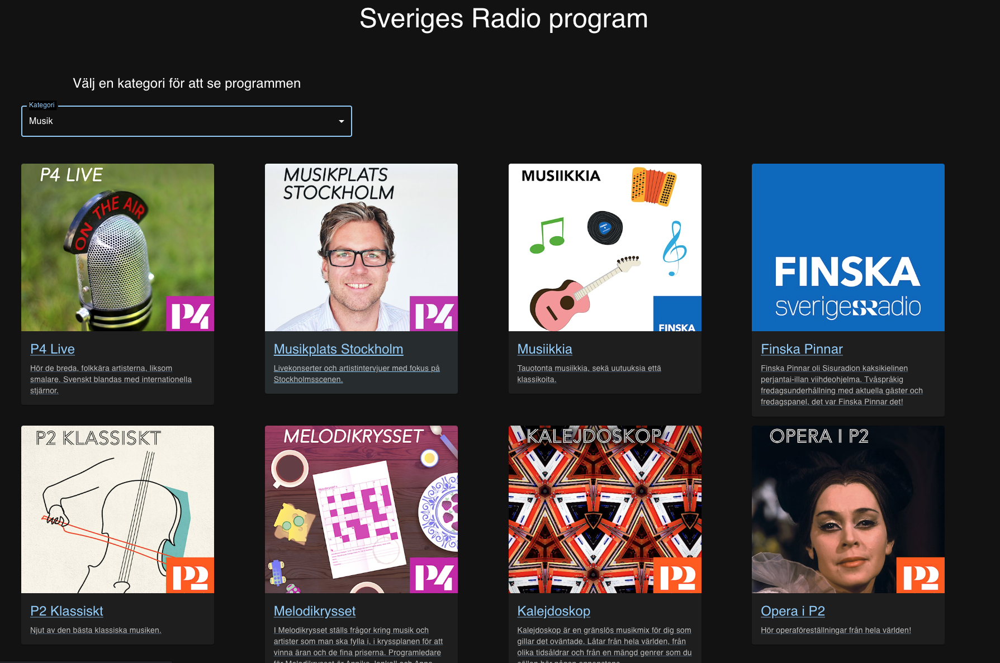
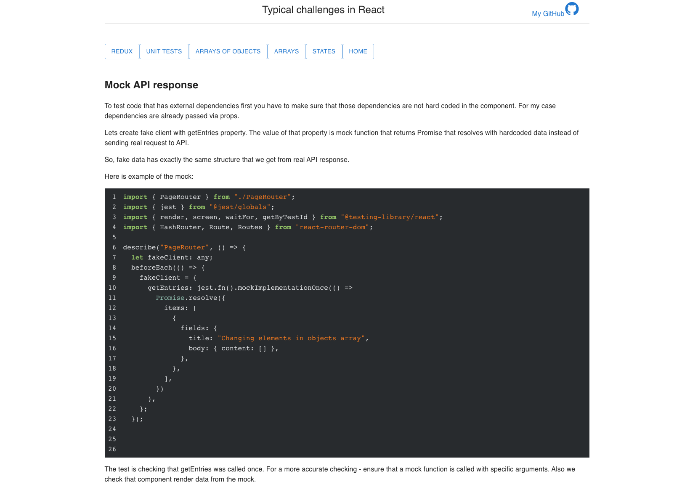

## 👋 Hi, I’m Liza

- 👩🏻‍💻 I am Web developer with 3 years of experience and continue learning new things every day.
- 🤓 I like to learn new, unknown to me.
- 🌏 I am always ready to help my colleagues and friends.

### There are some of my projects: 

#### My Portfolio
  
  
   #### Swedish Radio
  
  
#### Typical challenges in React
  
  

  

### Skills

### :fire: My Stats:

